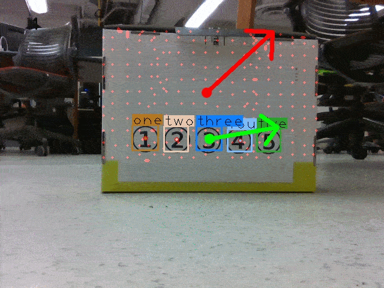

# Simon Says
## Goal: I say a target object, then the robot detects it and moves there.

This is my spring project at Northwestern University, the MS Robotics program.  
Time: 2019/04-06.


--------------------

Test detection:  


Robot moves to the target number:  


--------------------

Demo video: [doc/video_demo.mp4](doc/video_demo.mp4)

Content of the video demo:
``` 
0:00-1:10: Test object detection.
1:10-1:20: Object detection.
1:27-1:35: Use speech command to specify the target.
1:36-2:03: Robot moves to the target object.
```

# 1. Intro to the project


**Hardware:**  
* Turtlebot3-Waffle-Pi (a 2-wheel robot)  
* RGBD camera (Intel Realsense)
* A white board with numbers on it, including ①, ②, ③, ④, ⑤.
* My laptop as the main processor.

**Procedures and goals:** 
1. I put the Turtlebot robot on the ground.
2. I put the white board in front of the robot with some arbitrary pose.
3. I say a target number in English, such as "one" or "two". 
4. The robot detects the target number, and locates its position and orientation.
5. The robot moves to the white board and hits the target.

**Key techniques:**    
* Speech recognition (classification).
* Object detection to find targets.
* Point cloud processing for locating the target's orientation.
* Use control algorithm to move robot to the desired pose.

**Environments:**
* ROS Melodic on Turtlebot with Python 2.
* ROS Melodic on my laptop with Python 2.
* Python 3 on my laptop for speech recognition and object detection. Communicate with ROS through file.

# 2. Main components

## 2.0 Hardware setup
Turtlebot, Realsense camera, my laptop.

## 2.1 Speech commands recognition
I've trained an LSTM model to classify 11 types of audio clips, namely: 
> one, two, three, four, five, front, back, left, right, stop, none

Code: [src/speech_recognition/](src/speech_recognition/)  
Details: Please see this project:
https://github.com/felixchenfy/Speech-Commands-Classification-by-LSTM-PyTorch 

## 2.2 Object detection by Yolo
Detect numbers 1~5 in RGB image.

It's trained on 90 real images and 4000 thousand synthesized images, with a learning rate of 1e-3 or 1e-4, and trained for about 400 epoches in total. 

I've lost the configuration file, so this training is not reproducible. But the main code, all data, and trained weights are still there, and are listed below:  
Code: [src/detection/yolo/](src/detection/yolo/)  
Data: [src/detection/yolo/data/README.md](src/detection/yolo/data/README.md)    
Weights: [src/detection/yolo/weights/README.md](src/detection/yolo/weights/README.md)   
Details of how the code works: Please see this project: https://github.com/felixchenfy/Yolo_as_Template_Matching

## 2.3 Plane detection by RANSAC
Since the target numbers are on a white board, their orientation is the normal directioni of the board's plane, which I use RANSAC to detect.

Code: [src/detection/detect_plane.py](src/detection/detect_plane.py)

## 2.4 Control algorithm for wheeled robot

Given a robot's:  
```
current pose: (x, y, theta)  
goal pose:    (x*, y*, theta*)
```
I've implemented a **"drive to pose"** algorithm that could drive the robot to the goal position based on feedback control.

Code: [src/turtlebot_control/move_turtle_to_pose.py](src/turtlebot_control/move_turtle_to_pose.py)  
Reference: [Robotics, Vision and Control](https://link.springer.com/book/10.1007/978-3-642-20144-8), Chapter 4.1.1.4--Moving to a Pose.

# 3. How to run

For connecting to Turtlebot and setting things up,  
please see:  [doc/readme1_start_turtlebot.md](doc/readme1_start_turtlebot.md)

For testing whether the Turtlebot is working OK, as well as some other tests,  
please see:
[doc/readme2_tests.md](doc/readme2_tests.md)

Then, the main commands are illustrated below:

* Start script for **Object detection**:  
    > $ roscd simon_says; open_anaconda; cd src/detection; python yolo_response.py

* Run main program [src/main.py](src/main.py):
    > rosrun simon_says main.py 

* Start script for inputting **Speech Command**:   
    > $ roscd simon_says; open_anaconda; cd src/speech_recognition; python voice_speaker.py  

    (After starting this, the keyboard key "R" should be pressed only when you want to record the audio)

    Press key "R" to record audio and send your command to the laptop.

    After receiving a good command, the robot will move to the target.
